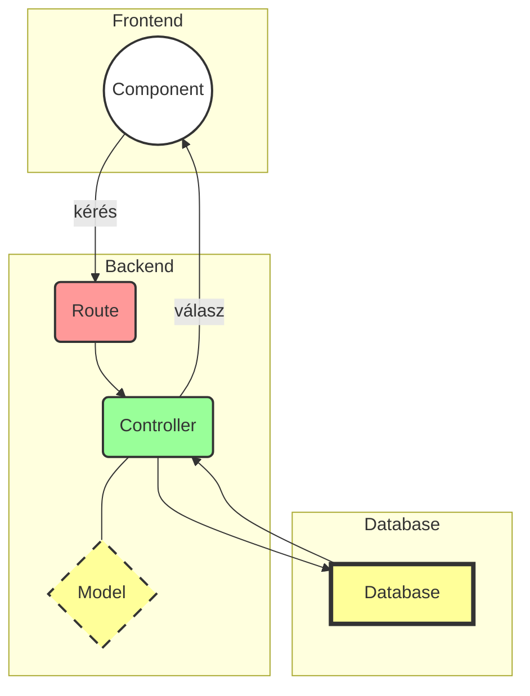

# Orders

- Rendelés leadása
- Rendelés módsítása/ törlése
- Listázás: Populate vs Join


## Order model
```javascript
const mongoose = require('mongoose');

const orderSchema = mongoose.Schema({
  user: {
    type: mongoose.Schema.Types.ObjectId,
    ref: 'User',
    required: true,
  },
  address: {
    city: {
      type: String,
      required: false,
    },
    address: {
      type: String,
      required: false,
    },
    address2: {
      type: String,
    },
    zip: {
      type: Number,
      required: false,
    },
  },
  invoiceAddress: {
    city: {
      type: String,
      required: false,
    },
    address: {
      type: String,
      required: false,
    },
    address2: {
      type: String,
    },
    zip: {
      type: Number,
      required: false,
    },
  },
  products: [{
    product: {
      type: mongoose.Schema.Types.ObjectId,
      ref: 'Product',
      required: true,
    },
    quantity: {
      type: Number,
      required: true,
    },
  }],
}, {
  timestamps: true,
});


module.exports = mongoose.model('Order', orderSchema);
```
## Order controller



```javascript
const Order = require('../models/order');
const mongoose = require('mongoose');
mongoose.Promise = require('bluebird');

module.exports = {
  
  list: (req, res) => {
    Order.find()
      .populate('user', 'username')
      .populate('products.product', 'productName productPrice')
      .exec()
      .then(orders => res.status(200).json(orders))
      .catch(err => res.status(500).send(err));
  },

  find: (req, res) => {
    Order.findById(req.params.id)
      .populate('user', 'username')
      .populate('products.product', 'productName productPrice')
      .exec()
      .then(order => res.status(200).json(order))
      .catch(err => res.status(500).send(err));
  },

  create: (req, res) => {
    Order.create(req.body)
      .then((order) => {
        if (order) {
          res.status(200).json(order);
        } else {
          res.status(500).json({
            error: order,
          });
        }
      })
      .catch(err => res.status(500).json({
        error: err,
      }));
  },

  update: (req, res) => {
    Order.findByIdAndUpdate(req.params.id, req.body)
      .then(order => res.status(200).json(order))
      .catch(err => res.status(500).send(err));
  },

  remove: (req, res) => {
    Order.findByIdAndRemove(req.params.id)
      .then(order => res.status(200).json(order))
      .catch(err => res.status(500).send(err));
  },
};
```

# Comment
- Komment hozzáadása: több tábla együttes módosítása
>

## Comment model

```javascript
const mongoose = require('mongoose');

const commentSchema = mongoose.Schema({
  user: {
    type: mongoose.Schema.Types.ObjectId,
    ref: 'User',
    required: true,
  },
  text: {
    type: String,
    required: true,
  },
}, {
  timestamps: true,
});


module.exports = mongoose.model('Comment', commentSchema);

```
## Comment controller
```javascript
const Comment = require('../models/comment');
const productController = require('../controller/products.controller');
const mongoose = require('mongoose');
mongoose.Promise = require('bluebird');


module.exports = {
 
  list: (req, res) => {
    Comment.find()
      .populate('user', 'username')
      .exec()
      .then(comments => res.status(200).json(comments))
      .catch(err => res.status(500).send(err));
  },

  find: (req, res) => {
    Comment.findById(req.params.id)
      .populate('user', 'username')
      .exec()
      .then(comment => res.status(200).json(comment))
      .catch(err => res.status(500).send(err));
  },

  create: (req, res) => {
    Comment.create(req.body)
      .then(comment => productController.addComment(req.params.prodid, comment._id))
      .then((comment) => {
        if (comment) {
          res.status(200).json(comment);
        } else {
          res.status(500).json({
            error: comment,
          });
        }
      })
      .catch(err => res.status(500).json({
        error: err,
      }));
  },
 
  update: (req, res) => {
    Comment.findByIdAndUpdate(req.params.id, req.body)
      .then(comment => res.status(200).json(comment))
      .catch(err => res.status(500).send(err));
  },

  remove: (req, res) => {
    Comment.findByIdAndRemove(req.params.commid)
      .then(comment => productController.removeComment(req.params.prodid, comment._id))
      .then(comment => res.status(200).json(comment))
      .catch(err => res.status(500).send(err));
  },
};
```

# Tesztek

- Miért kellenek tesztek?
- Unit testing
> 


```javascript
// Order post test
  describe('create()', () => {
    it('should create order in database', (done) => {
      chai.request(orderUrl)
        .post('/')
        .set('Cookie', cookie)
        .send(order)
        .end((err, res) => {
          id += res.body._id;
          expect(res).to.have.status(200);
          res.body.should.be.a('Object');
          res.body.user.should.be.eql('5afa961c9454c01ea4b35bfc');
          res.body.products[0].product.should.be.eql('5af9917fbb6b544b14321638');
          res.body.products[0].quantity.should.be.eql(1);
          res.body.products[1].product.should.be.eql('5af99826722bf5522c3d40a1');
          res.body.products[1].quantity.should.be.eql(2);
          res.body.address.should.be.eql({
            city: 'test',
            address: 'test',
            address2: 'test',
            zip: 1234,
          });
          res.body.invoiceAddress.should.be.eql({
            city: 'test2',
            address: 'test2',
            address2: 'test2',
            zip: 4321,
          });
          done();
        });
    });
  });
```